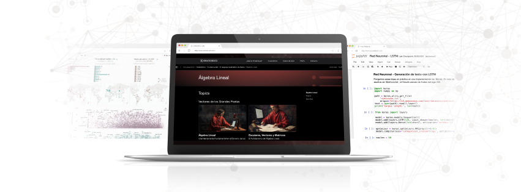

# Álgebra Lineal - Fase de Exploración en KreatioDocs

Bienvenidos a la sección de **Álgebra Lineal** de la **Fase de Exploración** en *KreatioDocs*. En el proceso de practicar *Machine Learning*, escucharás términos de moda relacionados con el Álgebra Lineal. ¿Vector, matriz, tensor? Esas son definiciones básicas. En esta serie de capítulos, se introducen algunas de las definiciones más comúnmente utilizadas.

## Contenidos de esta Sección

Aquí encontrarás una serie de tutoriales interactivos que cubren desde los conceptos fundamentales hasta conceptos avanzados en el álgebra lineal. Cada tutorial está diseñado para proporcionarte conocimientos prácticos y teóricos que te permitirán avanzar en tu comprensión de innmeso mundo de los datos y las matemáticas.

### Tutoriales Disponibles

- **Introducción a Numpy**: Este capítulo está dedicado a **NumPy**, una de las bibliotecas de computación científica más importantes para Álgebra Lineal y, por ende, de Machine Learning. Dado que la utilizaremos con frecuencia, es importante saber cómo utilizarla.

## Objetivos de Aprendizaje

- Aplicar los conceptos fundamentales del álgebra lineal visto en los artículos a ejercicios prácticos que te prepararán para problemas reales.
- Implementar y resolver los diferentes problemas relacionados con el álgebra lineal utilizando Python y sus librerías o bibliotecas más conocidas como *Numpy*.

## Recursos Adicionales

- Acceso a ejercicios prácticos para reforzar el aprendizaje.
- Enlaces a documentación oficial y recursos externos para una comprensión más profunda.

---

[Regresar a la Página Principal de la Fase de Exploración](../README.md)