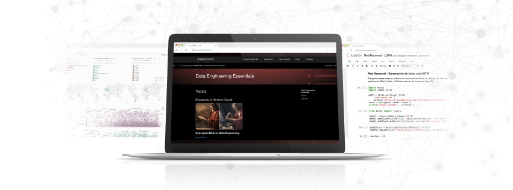

# Data Engineering - Fase de Exploración en KreatioDocs

Bienvenidos a la sección de **Data Engineering** de la **Fase de Exploración** en *KreatioDocs*. Esta sección está diseñada para acompañarte en el camino de la ingeniería de datos, uno de los pilares más importantes de los sistemas de implementación en el mundo digital.

## Contenidos de esta Sección

Aquí encontrarás una serie de tutoriales interactivos que cubren desde los conceptos fundamentales hasta conceptos avanzados en la ingeniería de datos. Cada tutorial está diseñado para proporcionarte conocimientos prácticos y teóricos que te permitirán avanzar en tu comprensión de innmeso mundo de los datos.

### Tutoriales Disponibles

- **Introducción al procesamiento Batch y la concurrencia**: Conoce los conceptos básicos del procesamiento en batch, también conocido como procesamiento en bloque, y la concurrenciade procesos.

## Objetivos de Aprendizaje

- Aprender los principios fundamentales del Big Data para permitir que varios computadores puedan trabajar juntos en resolver una misma tarea.
- Aplicación e implementación del procesamiento en batch, también conocido como procesamiento en bloque, y la concurrenciade procesos.

## Recursos Adicionales

- Acceso a ejercicios prácticos para reforzar el aprendizaje.
- Enlaces a documentación oficial y recursos externos para una comprensión más profunda.

---

[Regresar a la Página Principal de la Fase de Exploración](../README.md)