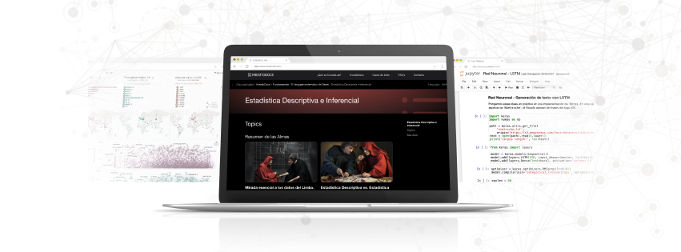

# Estadística Descriptiva e Inferencial - Fase de Exploración en KreatioDocs

Bienvenidos a la sección de **Estadística Descriptiva e Inferencial** de la **Fase de Exploración** en *KreatioDocs*. Esta sección está diseñada para acompañarte en el camino de la estadística descriptiva e inferencial, pilares fundamentales en el análisis de datos, machine learning y mucho más.

## Contenidos de esta Sección

Aquí encontrarás una serie de tutoriales interactivos que cubren desde los estadísticos fundamentales hasta conceptos avanzados en la estadística inferencial. Cada tutorial está diseñado para proporcionarte conocimientos prácticos y teóricos que te permitirán avanzar en tu comprensión de innmeso mundo de las estadísticas.

### Tutoriales Disponibles

- **Estadísticos de Localización**: Conoce las diferencias, así como las ventajas y desventajas de los diferentes estadísticos de tendencia central. Aplícalos usando tanto la lógica como las librerías que exiten hoy en día.

## Objetivos de Aprendizaje

- Aprender los diferentes tipos de estadísticos y sus principales usos en la Estadística Descriptiva.
- Aplicación e implementación de las diferentes ecuaciones y lógicas estadíisticas en un lenguaje de programación como Python.

## Recursos Adicionales

- Acceso a ejercicios prácticos para reforzar el aprendizaje.
- Enlaces a documentación oficial y recursos externos para una comprensión más profunda.

---

[Regresar a la Página Principal de la Fase de Exploración](../README.md)