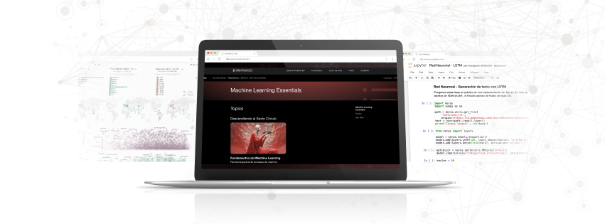

# La Belleza de Beatriz en los datos - Fase de Exploración en KreatioDocs

En *KreatioDocs*, la plataforma interactiva de **KreatioLab**, les damos la bienvenida al tutorial integrador de la sección **La belleza de Beatriz en los datos** de la Fase de Exploración. Creado para convertir a los principiantes en expertos en visualización y análisis de datos con una base sólida, este tutorial les guiará a través de todos los conceptos esenciales que vimos durante las lecturas. ¡Comencemos juntos este emocionante viaje!

## Contenidos de esta Sección

Aquí encontrarás una serie de tutoriales interactivos que cubren desde los conceptos fundamentales hasta conceptos avanzados del *análisis y visualización de datos*. Cada tutorial está diseñado para proporcionarte conocimientos prácticos y teóricos que te permitirán avanzar en tu comprensión de la visualización de datos.

### Tutoriales Disponibles

- **Visualización y Análisis de Datos con Python: Un Enfoque Práctico sobre Préstamos**: En este tutorial, nos sumergiremos en el corazón del análisis de datos, empleando Python para desentrañar las historias ocultas detrás de un dataset de préstamos. Exploraremos cómo la correcta visualización de datos no solo es fundamental para comprender las tendencias y patrones, sino que también es crucial para tomar decisiones informadas basadas en esos datos.

## Objetivos de Aprendizaje

- Establecer una base sólida repasando algunos conceptos clave del análisis de datos. Daremos un breve recorrido por las herramientas y librerías que Python pone a nuestra disposición para ello: `Matplotlib`, `Seaborn`, y `Pandas`.
- Implementar los tres aspectos clave de la preparación de datos: la limpieza y el preprocesamiento, la selección y transformación de datos, y la agrupación de datos para análisis.
- Incorporar al análisis las visualizaciones avanzadas y la integración de estas en dashboards interactivos.
- Desarrollar capacidad analítica para descubrir tendencias, patrones, y posibles anomalías dentro de nuestro conjunto de datos. Nuestro enfoque no solo estará en "qué" muestran los datos, sino también en el "por qué" detrás de estos patrones y cómo pueden influir en las decisiones.

## Recursos Adicionales

- Acceso a ejercicios prácticos para reforzar el aprendizaje.
- Enlaces a documentación oficial y recursos externos para una comprensión más profunda.

---

[Regresar a la Página Principal de la Fase de Exploración](../README.md)