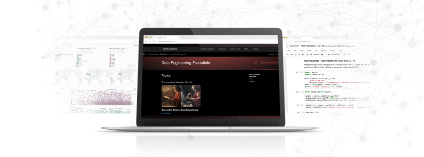

# Machine Learning - Fase de Exploración en KreatioDocs

Bienvenidos a la sección de **Machine Learning** de la **Fase de Exploración** en *KreatioDocs*. Esta sección está diseñada para acompañarte en el camino del inmenso mundo del *Machine Learning*, donde exploraremos y pondremos en práctica los diferentes algoritmos de clasificación, regresión, clustering y mucho más.

## Contenidos de esta Sección

Aquí encontrarás una serie de tutoriales interactivos que cubren desde los conceptos fundamentales hasta conceptos avanzados del *machine learning*. Cada tutorial está diseñado para proporcionarte conocimientos prácticos y teóricos que te permitirán avanzar en tu comprensión del modelo de datos.

### Tutoriales Disponibles

- **Hands-On: Análisis y Predicción del Consumo de Cerveza con Python: Aplicando Regresión Lineal**: En este primer tutorial, abordaremos los conceptos fundamentales del modelo de machine learning con Python, específicamente con la librería de Scikit Learn, analizando y prediciendo el consumo de una de las bebidas más conocidas del mundo a través de datos.

## Objetivos de Aprendizaje

- Aprender los principios fundamentales del análisis y modelado de datos con Python y sus librerías más populares como *Scikit Learn*, *Tensorflow*, *Keras*, *Statsmodels*, etc.
- Implementar correctamente la selección del modelo junto con su hiperparametrización para su óptimo funcionamiento y ajuste a los datos.
- Comunicar y transmitir de manera clara y concisa los resultados de la implementación del modelo o sistema de ML.

## Recursos Adicionales

- Acceso a ejercicios prácticos para reforzar el aprendizaje.
- Enlaces a documentación oficial y recursos externos para una comprensión más profunda.

---

[Regresar a la Página Principal de la Fase de Exploración](../README.md)