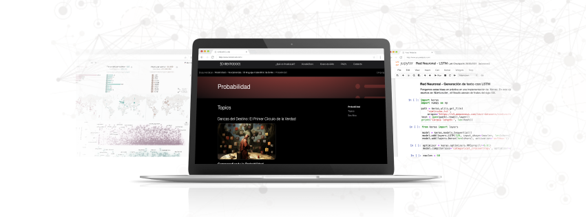

# Probabilidad - Fase de Exploración en KreatioDocs

Bienvenidos a la sección de **Probabilidad** de la **Fase de Exploración** en *KreatioDocs*. Esta sección está diseñada para introducirte en el fascinante mundo de la probabilidad, un pilar fundamental en el análisis de datos, machine learning y mucho más.

## Contenidos de esta Sección

Aquí encontrarás una serie de tutoriales interactivos que cubren desde la base del cálculo de la probabilidad hasta llegar a una intuición de lo que es el Teorema de Bayes. Cada tutorial está diseñado para proporcionarte conocimientos prácticos y teóricos que te permitirán avanzar en tu comprensión de las probabilidades.

### Tutoriales Disponibles

- **Probabilidad Conjunta**: Aprende sobre los conceptos básicos de probabilidad utilizando datos de la vida real junto con Python y saca conclusiones sobre ellos.
- **Probabilidad Condicional**: Descubre y desarrolla una de las teorías más importantes de la probabilidad como lo es la Probabilidad Condicional.
- **Ley de Probabilidad Total**: Profundiza sobre los teoremas que constituyen la base del Teorema de Bayes.

## Objetivos de Aprendizaje

- Comprender y aplicar los fundamentos de la probabilidad a los distintos problemas de la vida real.
- Manejar eficazmente las fórmulas y cálculos de las teoría probabilísticas utilizando Python.
- Desarrollar y elaborar conclusiones fundamentadas teniendo en cuenta los resultados de la probabilidad.

## Recursos Adicionales

- Acceso a ejercicios prácticos para reforzar el aprendizaje.
- Enlaces a documentación oficial y recursos externos para una comprensión más profunda.

---

[Regresar a la Página Principal de la Fase de Exploración](../README.md)