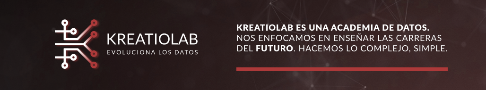
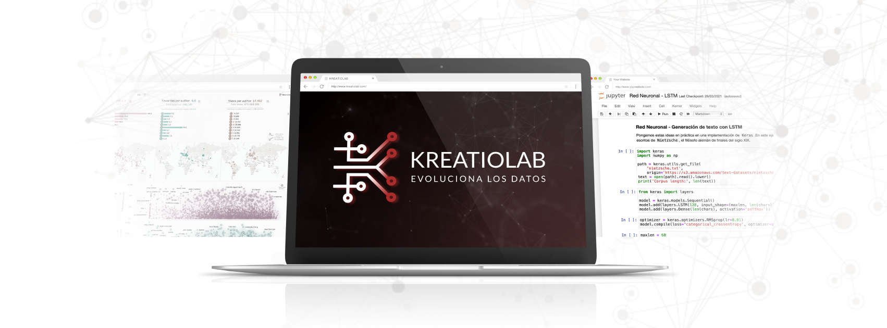
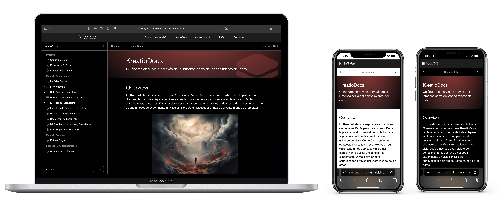
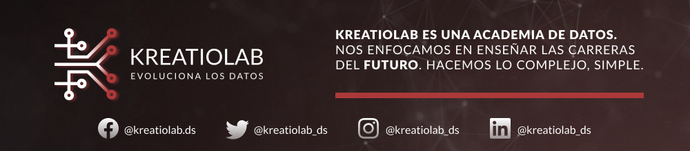

# Fase de Exploración en KreatioDocs - KreatioLab

## Bienvenida a los Tutoriales de KreatioLab - Evoluciona los Datos

¡Bienvenidos a la **Fase de Exploración** de *KreatioDocs*, la plataforma interactiva en español de **KreatioLab**! Aquí comienza tu aventura en el mundo de la programación, data analytics, business intelligence, machine learning, deep learning, data engineering y artificial intelligence.

### Acerca de Esta Fase

La **Fase de Exploración** es tu punto de partida en **KreatioLab**, donde, al igual que *Dante* en la *Selva Oscura*, te familiarizarás con las bases y comenzarás a descifrar el lenguaje oculto de los datos. En esta fase, cubrimos los "Essentials" de los Fundamentals, Data Analytics, Machine Learning, Deep Learning, MLOps y Data Engineering y mucho más…

### Contenido de los Tutoriales

Actualmente, ofrecemos los siguientes tutoriales interactivos, con nuevos contenidos añadidos semanalmente:

- **Matemáticas Básicas y Cálculo**:
    - Modelos Lineales
- **Probabilidad:**
    - A
    - B
- **Programación:**
    - Instalación Entornos de Desarrollo (IDEs)
    - Secuencias: Listas, Tuplas, Diccionarios y Sets
    - Explorando Estructuras de Control ********
    - Introducción a las Funciones en Python

### Recursos Interactivos

En *KreatioDocs*, encontrarás ejercicios prácticos, material descargable y tutoriales interactivos, todos diseñados para complementar tu aprendizaje.

### Material Gratuito y Acceso a Recursos

- **Tutoriales Interactivos en Español**: Accede a tutoriales gratuitos en *KreatioDocs*.
- **Material Complementario en GitHub**: Visita nuestro repositorio [nombre del repo](link al repo) para más recursos.

### Únete a la Revolución del Conocimiento

Suscríbete a nuestro newsletter y conecta con el mundo del dato. Al ser suscriptor, disfrutarás de:

- 📈 **Tendencias en Datos**
- 🛠️ **Actualizaciones de *KreatioDocs***
- 📖 **Recursos Premium**
- 🎁 **Promociones Únicas**

Suscríbete en [www.kreatiolab.com](http://www.kreatiolab.com/).

### Mantente Conectado

Síguenos y participa en nuestras comunidades en línea para obtener actualizaciones y compartir tus experiencias:

¡Emprende tu viaje en el mundo de los datos con KreatioLab y transforma tu comprensión del universo digital!

---

